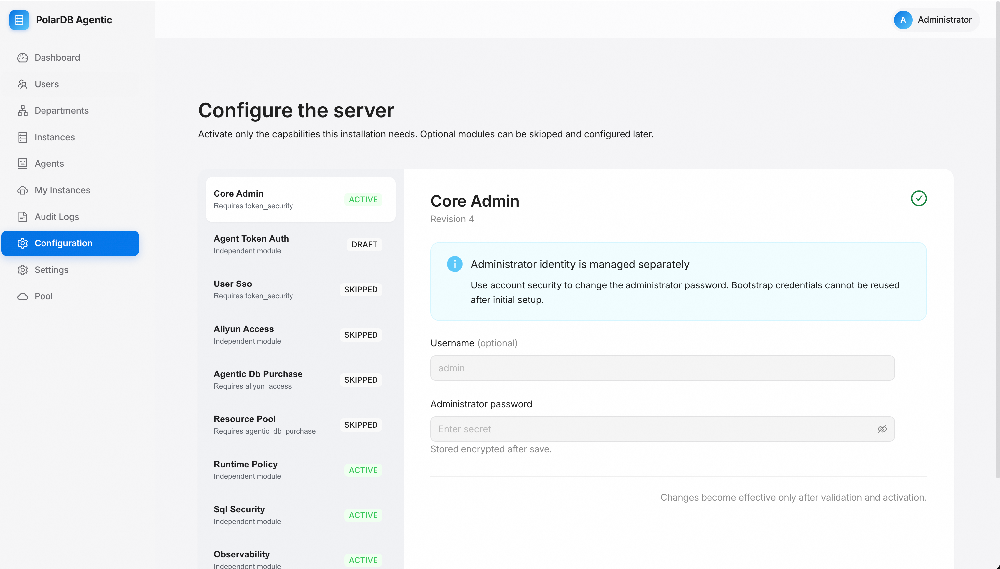
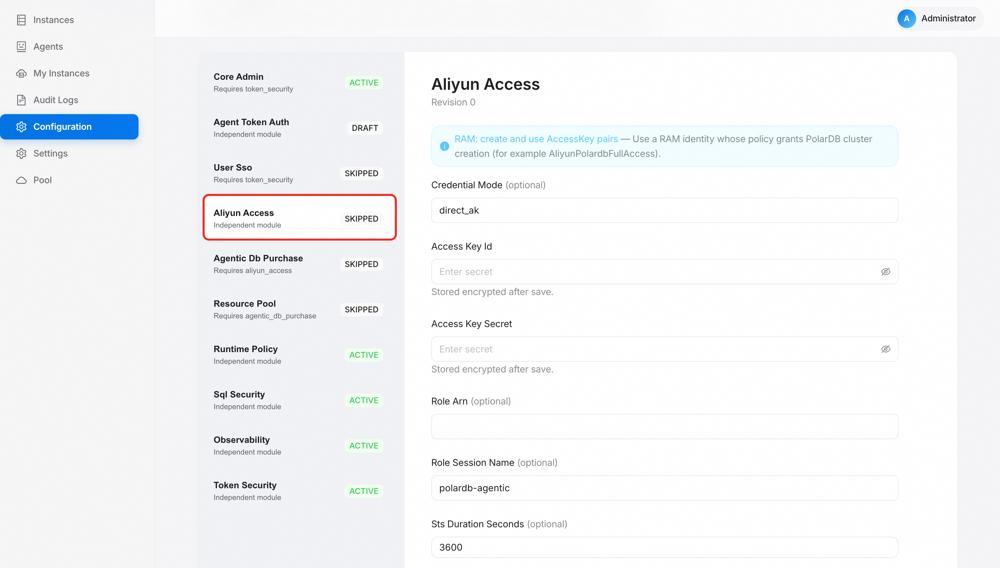
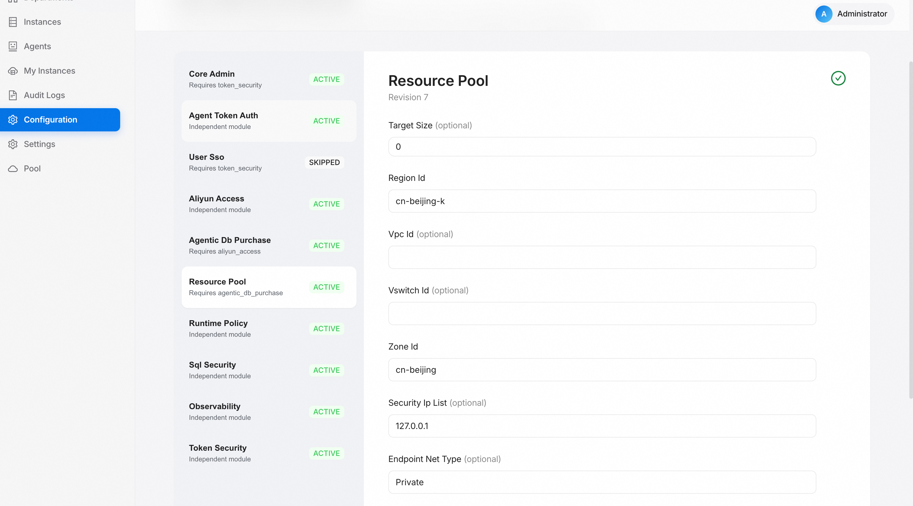

# Feature usage 1: guided configuration

**English** | [简体中文](../../zh-cn/getting-started/configure.md)

After claiming ownership, open the console to configure cloud credentials and
purchase settings. This page covers the minimum configuration needed to run
the resource pool.

## Open the configuration page

Signed in as an administrator, open `/settings/configuration`. Optional
modules can be configured step by step; each change creates a draft first and
is activated only after validation passes.

  

## Configure aliyun_access

Fill in the Alibaba Cloud credentials and region:

- `access_key_id` / `access_key_secret`: a RAM credential with PolarDB cluster
  management permissions.
- `region_id`: the target region.
- `endpoint_network`: choose `public` or `vpc` to decide which network reaches
  the PolarDB OpenAPI. If PAS runs in the same VPC as PolarDB, prefer `vpc`.

  

## Configure agentic_db_purchase

Set the purchase specification used when creating clusters (engine version,
node class, proxy, serverless scaling, storage, and so on). Defaults are fine
for a trial; adjust later as needed.

## Configure resource_pool

Set the network placement and pool parameters:

- `region_id` and `zone_id` are required.
- Both `vpc_id` and `vswitch_id` are required. PAS cannot automatically
  determine the VPC of the ECS instance, container, or Kubernetes environment
  where it runs, so it does not use the Alibaba Cloud account's default VPC.
- Specify a VPC reachable from PAS and choose a VSwitch in that VPC and target
  zone. PAS and the resource pool normally use the same VPC. If they use
  different VPCs, establish connectivity first, for example through Cloud
  Enterprise Network or VPC peering.
- `security_ip_list` must allow PAS to reach the database; do not leave it at
  the `127.0.0.1` default.

  

## Learn more

For module dependencies, declarative apply, export, and reload behavior, see
[Guided modular configuration](../configuration/guided-configuration.md).

Next: [Feature usage 2: register a database instance](./register-instance.md).
