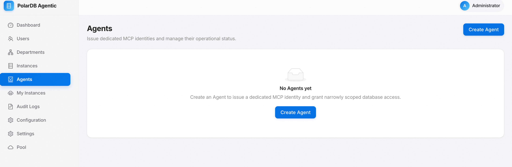
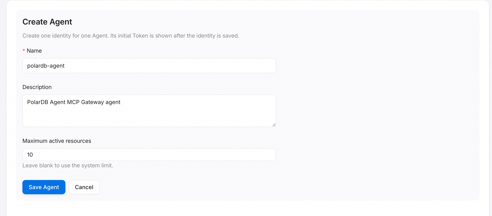
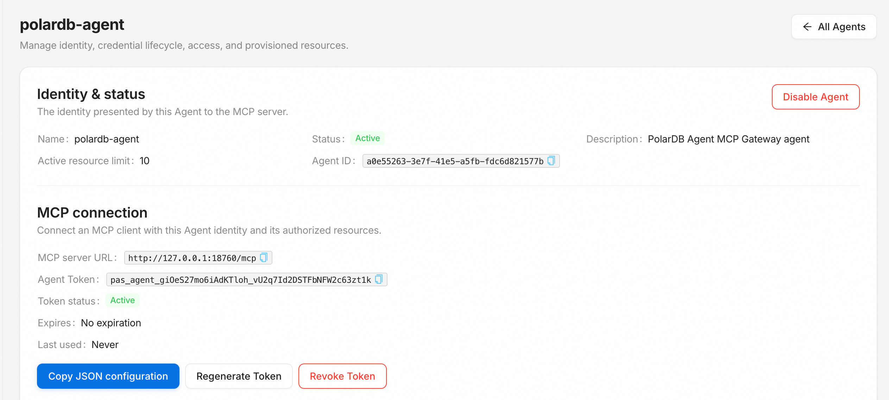
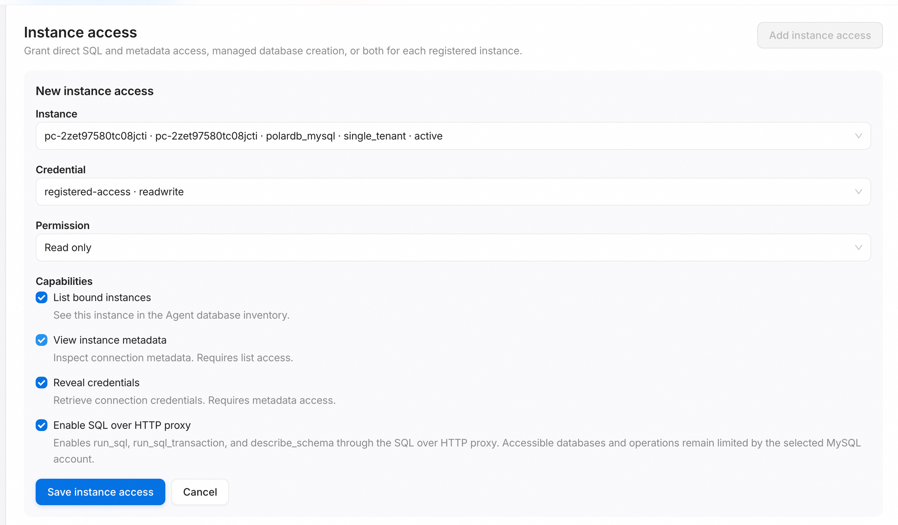
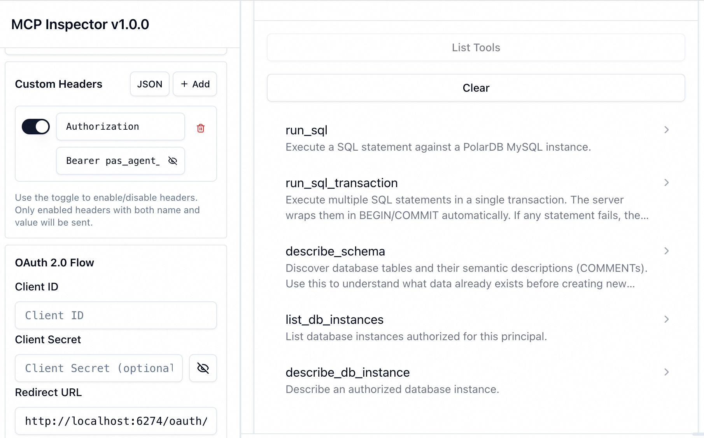
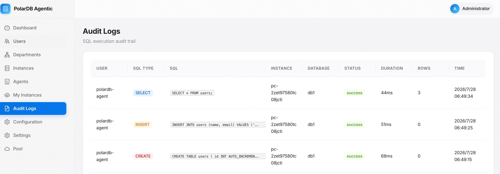

# 功能使用③：Agent、Token 与 MCP

[English](../../en/getting-started/agents-and-mcp.md) | **简体中文**

本页创建一个 Agent、签发 Token、授权其访问实例，并连接 MCP 客户端调用
数据库实例工具。

## 创建 Agent

在控制台创建一个 Agent，用于代表某个 AI 应用的机器身份。Agent 与人类
用户相互独立。

<p align="center">
  
</p>

<p align="center">
  
</p>

## 签发 Token

创建 Agent 时会自动签发一个 Agent Token，用于 MCP 客户端认证。点击
Agent 名称进入详情页可查看 Token 状态，并随时重新生成或吊销。

<p align="center">
  
</p>

## 授权实例访问

在 **Instance access** 中为 Agent 添加实例访问。注意：

- 只能选择状态为 `active` 或 `stopped` 的实例；处于 `creating` 或
  `failed` 的实例在下拉框中会被禁用，无法被绑定。
- 按需选择直连凭证、读写权限与能力（如列表、描述、凭证读取、SQL、
  建库等）。

<p align="center">
  
</p>

## 连接 MCP 客户端

点击 **Copy JSON configuration** 复制生成的连接配置，粘贴到 MCP 客户端。
配置形如：

```json
{
  "mcpServers": {
    "polardb": {
      "url": "http://<主机>:18760/mcp",
      "headers": { "Authorization": "Bearer <agent-token>" }
    }
  }
}
```

网络、TLS 与重连细节见
[连接 MCP 客户端](../agents/connect-mcp-client.md)。

## 调用数据库实例工具

连接成功后，Agent 可调用四个数据库实例工具：`list_db_instances`、
`create_db_instance`、`describe_db_instance`、`delete_db_instance`。
参数、标识符与错误语义见[工具参考](../agents/tool-reference.md)。

以 MCP Inspector 为例，连接后可以看到已授权的工具列表：

<p align="center">
  
</p>

Agent、Token 与绑定的管理细节见
[Agent 与 Token](../administration/agents-and-tokens.md)。

## 查看访问审计日志

Agent 通过 SQL 代理执行的每条语句都会记录审计。在控制台打开
**Audit Logs** 页面，可按用户、SQL 类型、实例与执行结果检视 Agent 的
访问行为。审计范围与保留策略见
[审计与安全](../administration/audit-and-security.md)。

<p align="center">
  
</p>

下一步：[功能使用④：资源池与实例](./resource-pool.md)。
