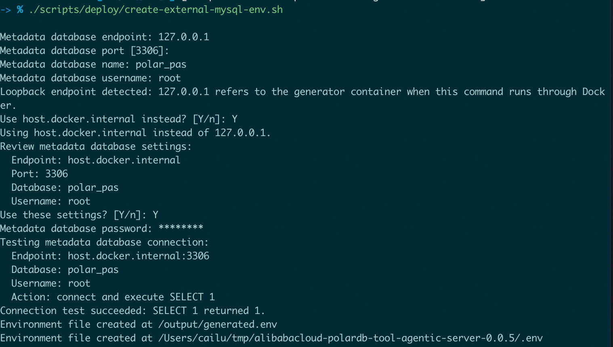

# 部署（单台 ECS + Docker Compose）

[English](../../en/getting-started/deploy-compose.md) | **简体中文**

本页在一台 ECS 上部署 PAS，元数据库使用
[资源要求](./cloud-resources.md)中准备好的 PolarDB MySQL。

## 前置条件

- 已获得 ECS 的 SSH 登录方式，并拥有 sudo 权限。
- 已获得 PolarDB 的连接地址、数据库名、用户名与密码。
- ECS 安全组已放通 TCP 18760。

## 第一步：安装 Docker

登录 ECS 后安装 Docker Engine 与 Compose 插件：

```bash
curl -fsSL https://get.docker.com | sh
sudo docker version
sudo docker compose version
```

若 Compose 不可用，请参考
[在 ECS 上安装并使用 Docker](https://help.aliyun.com/zh/ecs/user-guide/install-and-use-docker)
安装 Compose 插件。

## 第二步：下载部署文件

下载并解压要部署的版本：

```bash
PAS_VERSION=0.0.6
wget "https://github.com/aliyun/alibabacloud-polardb-tool-agentic-server/archive/refs/tags/v${PAS_VERSION}.tar.gz"
tar -xzf "v${PAS_VERSION}.tar.gz"
cd "alibabacloud-polardb-tool-agentic-server-${PAS_VERSION}"
```

后续命令均在该目录内执行。

## 第三步：生成 .env

运行容器化工具，按提示填写元数据库连接信息：

```bash
./scripts/deploy/create-external-mysql-env.sh
```

<p align="center">
  
</p>

工具会显示非敏感字段供确认，密码输入显示为 `*`，并在写入 `.env` 前执行
`SELECT 1`。输入有误时，在 `Use these settings? [Y/n]` 输入 `n` 重新填写。

通过 Docker 运行工具时，`127.0.0.1` 和 `localhost` 指向工具容器。MySQL
位于 macOS 或 Windows 的 Docker 宿主机时，可按提示改用
`host.docker.internal`；部署到 ECS 时通常应填写 PolarDB 连接地址。

成功生成的 `.env` 权限为 `0600`。请妥善备份该文件；重启与升级必须继续
使用其中的 `PAS_ENCRYPTION_KEY`。镜像同步、跳过连接测试及自动化生成方式见
[Docker Compose 部署参考](../deployment/docker-compose.md)。

若 GHCR 下载暂时失败，可重试：

```bash
docker pull "ghcr.io/aliyun/alibabacloud-polardb-tool-agentic-server:${PAS_VERSION}"
```

也可以使用 [v0.0.6 Release](https://github.com/aliyun/alibabacloud-polardb-tool-agentic-server/releases/tag/v0.0.6)
中的离线镜像包。

## 第四步：迁移并启动

先执行数据库迁移，再启动服务：

```bash
sudo docker compose --env-file .env -f deploy/compose/compose.external-mysql.yaml run --rm migrate
sudo docker compose --env-file .env -f deploy/compose/compose.external-mysql.yaml up -d server
sudo docker compose --env-file .env -f deploy/compose/compose.external-mysql.yaml ps
curl --fail http://127.0.0.1:18760/readyz
```

<p align="center">
  
</p>

`--env-file .env` 不可省略。只有 `migrate` 成功退出后才启动 `server`。

## 第五步：创建管理员

首次启动时，bootstrap token 会打印到容器日志：

```bash
sudo docker compose --env-file .env -f deploy/compose/compose.external-mysql.yaml logs server
```

<p align="center">
  
</p>

在浏览器打开 `http://<ECS 公网地址>:18760/setup`，输入 token：

<p align="center">
  
</p>

然后创建首个管理员，密码至少 12 位：

<p align="center">
  
</p>

token 已过期或需要重新签发时，参考
[初始化设置](../setup/initial-setup.md)。

多副本部署请参考
[Kubernetes 部署指南](../deployment/kubernetes-helm.md)和
[ACK 与 PolarDB](../deployment/ack-polardb.md)。

下一步：[功能使用①：引导式配置](./configure.md)。
