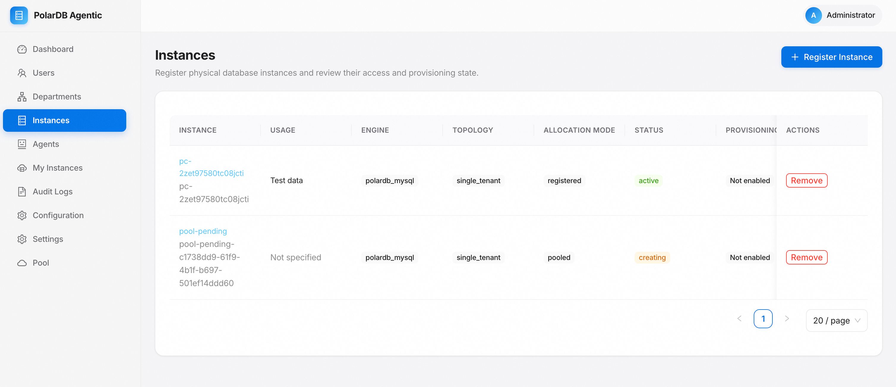
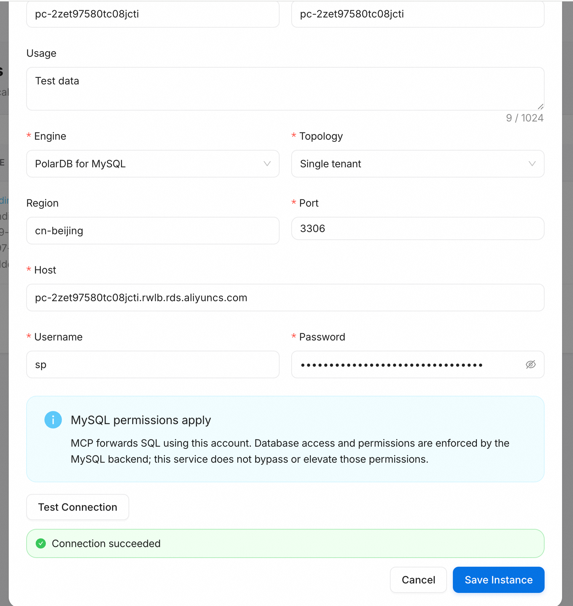

# 功能使用②：注册数据库实例

[English](../../en/getting-started/register-instance.md) | **简体中文**

除了由资源池自动创建实例，你也可以把已有的 PolarDB MySQL 集群注册进来，
再授权给 Agent 使用。本页完成一次手动注册。

## 打开实例列表

以管理员登录控制台，进入 **Instances** 页面。列表会展示每个实例的引擎、
拓扑、分配方式、状态与供应能力，右上角的 **Register Instance** 用于注册
新实例。

  

## 填写注册信息

点击 **Register Instance**，按表单填写目标集群的连接信息：

- **Cluster ID**：PolarDB 集群 ID，形如 `pc-xxxxxxxx`。
- **Name**：在控制台内展示的名称。
- **Usage**：用途说明，便于后续辨识（可选）。
- **Engine** / **Topology**：选择 `PolarDB for MySQL` 与 `Single tenant`。
- **Region** / **Port**：集群所在地域与端口（默认 3306）。
- **Host**：集群连接地址（Endpoint）。
- **Username** / **Password**：用于访问该实例的数据库账号。

该账号即 MCP 转发 SQL 时使用的身份，数据库权限完全由 MySQL 后端裁定，
本服务不会绕过或提升权限。因此请按最小权限原则准备账号。

## 测试连接并保存

点击 **Test Connection**，出现 **Connection succeeded** 后再点击
**Save Instance**。连接测试由处理该请求的服务副本发起，因此它同时验证了
服务到目标集群的网络连通性与账号有效性。

  

若测试失败，优先检查集群白名单是否放通服务所在 ECS 的地址、Host 与端口
是否正确，以及账号密码是否可用。

## 注册后的状态

保存成功后，实例以 `registered` 分配方式出现在列表中，状态为 `active`
即可被授权。只有 `active` 或 `stopped` 状态的实例才能绑定给 Agent。

## 深入阅读

连接信息、凭证管理、多租户预检与轮换的完整说明见
[实例注册](../database-instances/registration.md)与
[数据库实例访问与供应](../database-instances/access-and-provisioning.md)。

下一步：[功能使用③：Agent、Token 与 MCP](./agents-and-mcp.md)。
