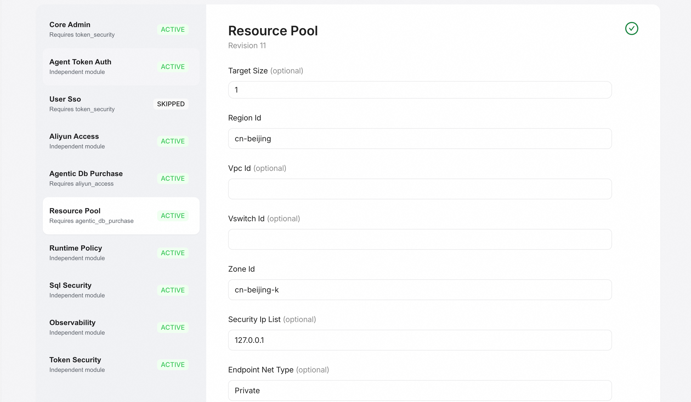
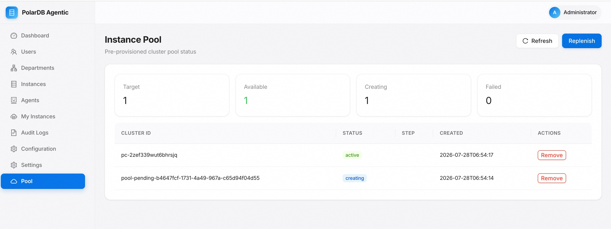

# 功能使用④：资源池与实例

[English](../../en/getting-started/resource-pool.md) | **简体中文**

资源池会按目标容量预建实例，用户申请时可直接命中，减少等待。本页设置目标
容量、触发补货并管理池中实例。

## 设置目标容量

在系统设置中将资源池目标容量（`target_size`）设为大于 0 的值。补货循环会
按目标容量自动预建实例；目标为 0 时不预建。

  

## 触发补货

在资源池页面点击 **Replenish** 可立即触发一次补货。页面会展示目标、可用、
创建中与失败的数量统计。

  

## 查看与管理实例

池中实例按状态展示：

- `active`：可用实例，可被分配或从池中移除。
- `creating`：创建中的实例。
- `failed`：创建失败的实例。

对于失败实例，以及创建任务因进程重启等原因中断、长期停留在
`pool-pending` 前缀的占位实例，可在页面上直接移除。

## 占位实例的自动清理

补货循环会自动清理长时间停留、无法继续推进的 `pool-pending` 占位记录，
从而释放补货名额，让新实例继续创建。

## 深入阅读

实例注册、访问与供应的完整说明见
[数据库实例访问与供应](../database-instances/access-and-provisioning.md)。

至此，你已完成从资源准备到功能体验的端到端流程。
